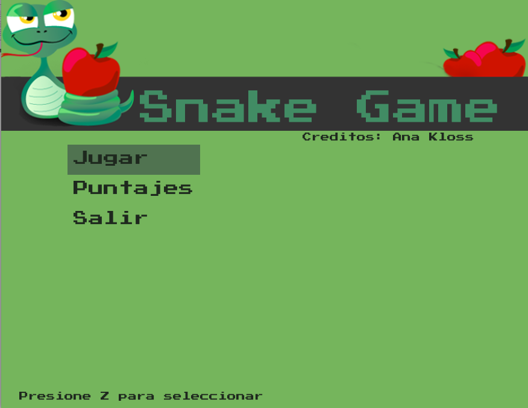
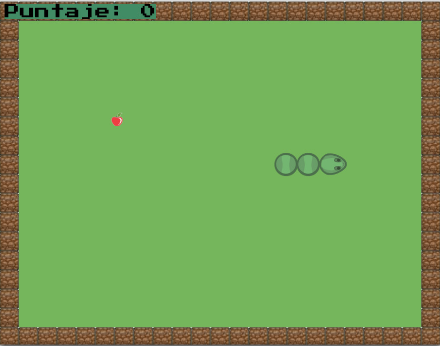
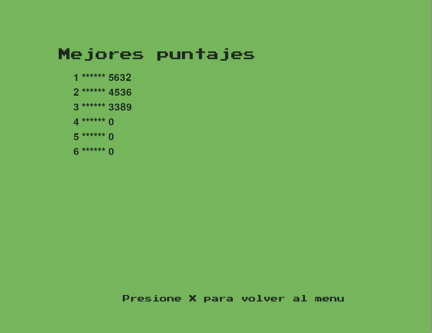

# Snake Game

##  Requisitos
* Python3
* [PyGame](https://www.pygame.org)

## Instalación
```
git clone https://github.com/anakloss/snake_game.git
cd snake_game/Snake
pip install pyGame
python3 SnakeGame.py
```

## Descripción
Juego Snake creado como TP Final para el curso "Programación en Python"

* El juego consiste en guíar a la serpiente hacia la comida.
* El objetivo es obtener el mejor puntaje.
* En este caso, las distintas frutas tienen un valor aleatorio, y pueden llegar a restar puntos.
* Se maneja con las flechas, el boton Z para elegir las opciones y X para volver al menu.

## Capturas de pantalla




## COPYRIGHT
Creado por Ana Kloss

## LICENSE
Ver LICENSE